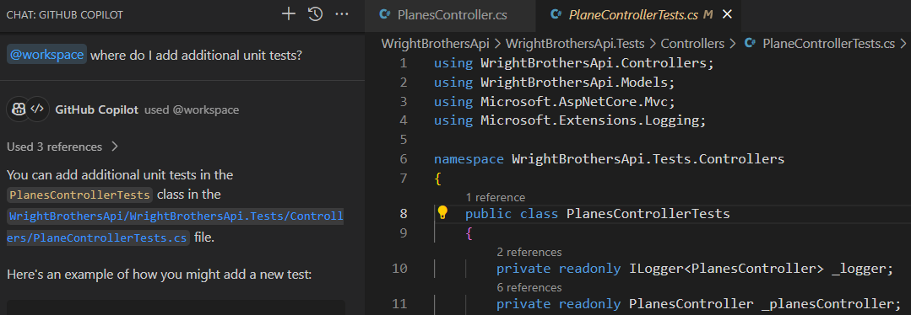
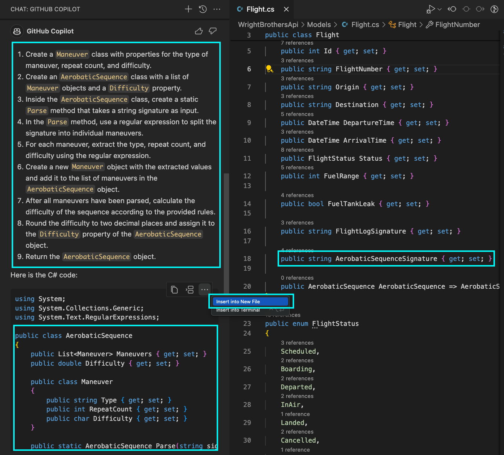

# Taking Off with Code: Clearing the Runway 
This lab exercise guides participants through coding exercises using GitHub Copilot to understand its suggestions and capabilities. It involves running and adding unit tests, with an emphasis on pair programming. The lab is structured in steps, starting with executing existing unit tests, followed by enhancing test coverage, and addressing specific functionalities like case sensitivity and trimming in search methods.

## Prerequisites
- The prerequisites steps must be completed, see [Labs Prerequisites](./Labs/Lab%201.1%20-%20Pre-Flight%20Checklist)

## Estimated time to complete
- 30 minutes, varying with optional labs.

## Objectives
- Simple coding exercises using GitHub Copilot, focusing on understanding its suggestions and capabilities.
- Pair programming: One 'pilot' codes, the other guides using Copilot's suggestions.

### Step 1: Taxying to the Runway - Run existing unit tests

- Open GitHub Copilot Chat Extension.

- Type the following in the chat window: 

    ```sh
    @terminal how do I to run the unit tests?
    ```

- Copilot will give a suggestion to run the unit tests in the terminal.

    ```sh
    dotnet test WrightBrothersApi.Tests/WrightBrothersApi.Tests.csproj
    ```

- Let's run the unit tests in the terminal to make sure everything is working as expected.

- From the Copilot Chat window, select one of the two options:
    1. Click the ellipses, `...`, select `Insert into Terminal`.

    1. If there isn't a terminal open, click the `Open in Terminal` button.

    1. Click copy button, then, open a new Terminal window by pressing **Ctrl+`** (Control and backtick), paste into Terminal window.

- Open the terminal and run the tests with the provided command.

    ```sh
    dotnet test WrightBrothersApi.Tests/WrightBrothersApi.Tests.csproj
    ```
>[!Note]
> If you get an error resembling this: `MSBUILD : error MSB1009: Project file does not exist.`, then you are most likely running this command from the wrong folder. Change into the correct directory with `cd ./WrightBrothersApi` or with `cd ..` to go one folder level upwards.

- The tests should run and pass.

    ```sh
    Starting test execution, please wait...
    A total of 1 test files matched the specified pattern.
    Passed!  - Failed:  0, Passed:  3, Skipped:  0, Total:  3
    ```

### Step 2: Pre-takeoff Pilot Checks - Completing Unit Tests

- Open GitHub Copilot Chat Extension.

- Type the following in the chat window: 

    ```sh
    @workspace where do I add additional unit tests?
    ```

- Copilot will give a suggestion to add unit tests to the `Controllers/PlanesControllerTests.cs` file in the `WrightBrothersApi.Tests` project.

    ```
    You can add additional unit tests in the `PlanesControllerTests` class in the `WrightBrothersApi.Tests/Controllers/PlaneControllerTests.cs` file.
    ```

- Open `PlanesControllerTests.cs` that GitHub Copilot suggested in the chat by clicking on the provided file name in the chat.



- Make sure to have the `PlanesController.cs` file open as well in your Visual Studio Code Editor in a tab next to the `PlanesControllerTests.cs` file.

>[!Note]
> Github Copilot will use any file that is open to gather extra context for its suggestions, this is why it's important to have the `PlanesController.cs` file open.

- Place your cursor at the end of the file, after the `}` of the `GetById_ReturnsPlane` method.

```csharp
public class PlanesControllerTests
{
    [Fact]
    public void GetById_ReturnsPlane()
    {
        // method body
    }

    <---- Place your cursor here
}
```

- Press `Enter`, GitHub Copilot will now suggest `[Fact]` for a missing unit tests based on the code in the `PlanesController.cs` file.

- Press `Tab` to accept the suggestion, press `Enter` to add a new line.

- GitHub Copilot will automatically suggest the a missing unit test. Accept the suggestion by pressing `Tab`.

    ```csharp
    public class PlanesControllerTests
    {
        // Rest of the methods

        [Fact]
        public void GetById_ReturnsNotFound()
        {
            // Arrange
            var id = 4;

            // Act
            var result = _planesController.GetById(id);

            // Assert
            result.Result.Should().BeOfType<NotFoundResult>();
        }
    }
    ```

- Now let's add a few more unit tests to the `PlanesControllerTests.cs` file.

- Place your cursor after the `}` of the `Post_AddsPlaneAndReturnsCreated` method.

    ```csharp
    public class PlanesControllerTests
    {
        // Other method

        [Fact]
        public void Post_AddsPlaneAndReturnsCreated()
        {
            // method body
        }

        <---- Place your cursor here

        // Other method
    }
    ```

- Press `Enter`, GitHub Copilot will now suggest `[Fact]` for a missing unit tests based on the code in the `PlanesController.cs` file.

- Press `Tab` to accept the suggestion, press `Enter` to add a new line.

- GitHub Copilot will now suggest a missing unit test for the `Post` method of the `PlanesController.cs` file. Accept the suggestion by pressing `Tab`.


    ```csharp
    public class PlanesControllerTests
    {
        // Other method

        [Fact]
        public void Post_AddsPlaneAndReturnsCreated()
        {
            // method body
        }

        [Fact]
        public void Post_ReturnsBadRequest()
        {
            // Arrange
            var plane = new Plane { Name = "Wright Plane 1", Description = "First plane" };
            _planesController.ModelState.AddModelError("Name", "Required");

            // Act
            var result = _planesController.Post(plane);

            // Assert
            result.Should().BeOfType<BadRequestObjectResult>();
        }

        // Other method
    }
    ```

>[!Note]
> Copilot understood that it's likely that another unit test for the `Post` method is required, because the cursor is placed after the `}` of the `Post_AddsPlaneAndReturnsCreated` method.

- You can repeat the process to add more unit tests to the `PlanesControllerTests.cs` file.

- Now let's run the unit tests in the terminal to make sure everything is working as expected.

- Open the terminal and run the tests with the provided command.

    ```sh
    dotnet test WrightBrothersApi.Tests/WrightBrothersApi.Tests.csproj
    ```

>[!Note]
> Some tests might fail. Copilot does not always provide the correct suggestions. It's important to understand the suggestions and do some extra work to make sure the tests are correct. Copilot can help you with that as well.

- The tests should run and pass.

    ```sh
    Starting test execution, please wait...
    A total of 1 test files matched the specified pattern.
    Passed!  - Failed:  0, Passed:  5, Skipped:  0, Total:  5
    ```

## Optional

### Step 3: Taking Off - Developing Robust Tests

- Open the `PlanesController.cs` file.

- Make sure to add the `SearchByName` method to the `PlanesController.cs` file if you haven't already in the previous lab.

    ```csharp
    public class PlanesController : ControllerBase
    {
        /* Rest of the methods */
        
        [HttpGet("search")]
        public ActionResult<List<Plane>> SearchByName([FromQuery] string name)
        {

            var planes = Planes.FindAll(p => p.Name.Contains(name));

            if (planes == null)
            {
                return NotFound();
            }
            
            return Ok(planes);
        }
    }
    ```

- Make sure to have the `PlanesController.cs` file open as well in your Visual Studio Code Editor in a tab next to the `PlanesControllerTests.cs` file.

- Open `PlanesControllerTests.cs` file

- Place your cursor at the end of the file, after the last unit test `}`. This should be the `GetById_ReturnsNotFound()` method created in previous step.

    ```csharp
    public class PlanesControllerTests
    {
        [Fact]
        public void GetById_ReturnsNotFound()
        {
            // method body
        }

        <---- Place your cursor here
    }
    ```

- Now, copy/paste the following:

    ```csharp
        // Search by name term  | Amount of results | Test Description
        // Wright Flyer II      | 1                 | Specific search
        // Wright               | 3                 | General search
        // wright flyer         | 2                 | Case insensitive
        //  Wright  flyer       | 2                 | Extra spaces
    ```

- Press `Enter`, GitHub Copilot will automatically suggest the `[Theory]` attribute. Accept the suggestion by pressing `Tab`. If Copilot suggess the next comment, then press `Enter` once more.

>[!Note]
> GitHub Copilot will automatically suggest the `[Theory]` attribute because of the comments above the method. It understands that you want to run the same test with different parameters and outputs.

- Press `Enter`, GitHub Copilot will automatically suggest the `[InlineData]` attributes. Accept the suggestion by pressing `Enter`. Repeat this for each `[InlineData]` attribute.

    ```csharp
    [Theory]
    [InlineData("Wright Flyer II", 1, "Specific search")]
    [InlineData("Wright", 3, "General search")]
    [InlineData("wright flyer", 2, "Case insensitive")]
    [InlineData(" Wright  flyer ", 2, "Extra spaces")]
    public void SearchByName_ReturnsPlanes(string searchTerm, intexpectedAmountOfResults, string testDescription)
    {
        // Act
        var result = _planesController.SearchByName(searchTerm);

        // Assert
        var okObjectResult = (OkObjectResult)result.Result!;
        var returnedPlanes = (List<Plane>)okObjectResult.Value!;
        returnedPlanes.Should().HaveCount(expectedAmountOfResults, testDescription);
    }  
    ```

- Let's run the unit tests in the terminal to make sure everything is working as expected.

- Open the terminal and run the tests with the provided command.

    ```sh
    dotnet test WrightBrothersApi.Tests/WrightBrothersApi.Tests.csproj
    ```

- Not all tests will pass. For example the `Case insensitive` and `Extra spaces` test will fail. This is because the `SearchByName` method is case sensitive. Let's fix this.

> ![Note] It could happen that Copilot already made the method case insensitve during creation. You can then continue with the next task as still some tests cases will fail.

    ```
    Starting test execution, please wait...
    A total of 1 test files matched the specified pattern.
    Failed!  - Failed:     2, Passed:     6, Skipped:     0, Total:     8
    ```

- Open `PlanesController.cs` file.

- Select the entire `SearchByName` method.

- Ask Copilot to fix the case sensitivity issue by typing the following in the chat window: 

    ```
    @workspace /fix case sensitivity issue
    ```

- Copilot will give a suggestion to fix the case sensitivity issue.

    ```csharp
    public class PlanesController : ControllerBase
    {
        /* Rest of the methods */
        
        [HttpGet("search")]
        public ActionResult<List<Plane>> SearchByName([FromQuery] string name)
        {

            // Rest of the method

            var planes = Planes.FindAll(p => p.Name.Contains(name, StringComparison.OrdinalIgnoreCase)); // <---- Case insensitive

            if (planes == null)
            {
                return NotFound();
            }
            
            return Ok(planes);
        }
    }
    ```

>[!Note]
> You'll need to use the `StringComparer.OrdinalIgnoreCase` comparer in the FindAll method.

- Apply the changes to the `PlanesController.cs` file.
- Click on the `Insert at cursor` to replace the `SearchByName` method with the new one.

- Also the `Extra spaces` test will fail. This is because the `SearchByName` is not trimming the search term. Let's fix this.

- Open `PlanesController.cs` file

- Select the content of the `SearchByName` method.

- Ask Copilot to fix the trimming issue by typing the following in the chat window:

    ```
    @workspace /fix trimming issue
    ```

- Copilot will give a suggestion to fix the trimming issue.
    
    ```csharp
    public class PlanesController : ControllerBase
    {
        /* Rest of the methods */
        
        [HttpGet("search")]
        public ActionResult<List<Plane>> SearchByName([FromQuery] string name)
        {

            // Rest of the method

            name = name.Trim(); // <---- Removes leading and trailing spaces

            var planes = Planes.FindAll(p => p.Name.Contains(name, StringComparison.OrdinalIgnoreCase));

            if (planes == null)
            {
                return NotFound();
            }
            
            return Ok(planes);
        }
    }
    ```

- Apply the changes to the `PlanesController.cs` file.
- Click on the `Insert at cursor` to replace the `SearchByName` method with the new one.

- Let's run the unit tests in the terminal to make sure everything is working as expected.

- Open the terminal and run the tests with the provided command

    ```sh
    dotnet test WrightBrothersApi.Tests/WrightBrothersApi.Tests.csproj
    ```

- The tests should run and pass.

    ```sh
    Starting test execution, please wait...
    A total of 1 test files matched the specified pattern.
    Passed!  - Failed:     0, Passed:     8, , Failed:     0
    ```
>![NOTE] If the tests still fail, there is a good chance you need to also handle the use case of double spaces in the search paramater. Try to let Copilot suggest that fix as well and implement it.

## Optional

### Step 4 - Ascending to the Clouds: Creating the AirfieldController from thin air

- Open the `WrightBrothersApi` project in Visual Studio Code.

- Open the `Models/Airfields.cs` file.

- Open the Copilot Chat extension window.

- Ask the following question in GitHub Copilot chat window:

    ```
    @workspace Using the Airfield class, create an ApiController based on the first 3 airfields used by the Wright Brothers. Make sure to include all the CRUD operations.
    ```

- Copilot will give a suggestion to create an `AirfieldController` class based on the `Airfield` class.

    ```csharp
    using Microsoft.AspNetCore.Mvc;
    using System.Collections.Generic;
    using WrightBrothersApi.Models;

    [ApiController]
    [Route("[controller]")]
    public class AirfieldsController : ControllerBase
    {
        private List<Airfield> Airfields = new List<Airfield>
        {
            new Airfield("Kitty Hawk", "North Carolina", "1900-1903", "First successful flight"),
            new Airfield("Huffman Prairie", "Ohio", "1904-1905", "First practical airplane"),
            new Airfield("Fort Myer", "Virginia", "1908-1909", "Military flight trials")
        };

        // GET: api/Airfields
        [HttpGet]
        public IEnumerable<Airfield> GetAirfields()
        {
            return Airfields;
        }

        // GET: api/Airfields/5
        [HttpGet("{id}")]
        public ActionResult<Airfield> GetAirfield(int id)
        {
            if (id < 0 || id >= Airfields.Count)
            {
                return NotFound();
            }

            return Airfields[id];
        }

        // POST: api/Airfields
        [HttpPost]
        public ActionResult<Airfield> PostAirfield(Airfield airfield)
        {
            Airfields.Add(airfield);
            return CreatedAtAction(nameof(GetAirfield), new { id = Airfields.Count - 1 }, airfield);
        }

        // PUT: api/Airfields/5
        [HttpPut("{id}")]
        public IActionResult PutAirfield(int id, Airfield airfield)
        {
            if (id < 0 || id >= Airfields.Count)
            {
                return NotFound();
            }

            Airfields[id] = airfield;
            return NoContent();
        }

        // DELETE: api/Airfields/5
        [HttpDelete("{id}")]
        public IActionResult DeleteAirfield(int id)
        {
            if (id < 0 || id >= Airfields.Count)
            {
                return NotFound();
            }

            Airfields.RemoveAt(id);
            return NoContent();
        }
    }
    ```

- In the Copilot Chat extension window, click the ellipses `...` and select `Insert into New File` for the suggested `AirfieldController`.



- Copilot will add the code to a new empty file, but must be saved.
- Save the file by clicking pressing `Ctrl + S` or `Cmd + S`.
- Change directory to the `Controllers` folder`.
- Enter the file name `AirfieldController.cs` and click `Save`.

> [!Note]
> Copilot is not only context aware, knows you need a list of items and knows the `Air Fields` used by the Wright Brothers, the `Huffman Prairie`, which is the first one used by the Wright Brothers.

- Now that you have created the `AirfieldController` with CRUD operations, it's time to ensure that it's working as expected. In this step, you will write unit tests for the `AirfieldController`.

- Open the `AirfieldController.cs` file.

- Open the Copilot Chat extension window.

- Ask the following question in GitHub Copilot chat window:

    ```
    @workspace create all the unit tests for this AirfieldController
    ```

- Copilot will give a suggestion to create an `AirfieldControllerTests` class based on the `AirfieldController` class with all the needed unit tests.

    ```csharp
    using Xunit;
    using FluentAssertions;
    using Microsoft.AspNetCore.Mvc;
    using WrightBrothersApi.Models;
    using System.Collections.Generic;
    using System.Linq;

    public class AirfieldsControllerTests
    {
        private readonly AirfieldsController _controller;

        public AirfieldsControllerTests()
        {
            _controller = new AirfieldsController();
        }

        [Fact]
        public void GetAirfields_ReturnsAllAirfields()
        {
            var result = _controller.GetAirfields();

            result.Should().NotBeNull();
            result.Count().Should().Be(3);
        }

        [Fact]
        public void GetAirfield_ValidId_ReturnsAirfield()
        {
            var result = _controller.GetAirfield(1);

            result.Result.Should().BeOfType<OkObjectResult>();
            ((OkObjectResult)result.Result).Value.Should().BeOfType<Airfield>();
        }

        [Fact]
        public void GetAirfield_InvalidId_ReturnsNotFound()
        {
            var result = _controller.GetAirfield(100);

            result.Result.Should().BeOfType<NotFoundResult>();
        }

        [Fact]
        public void PostAirfield_ValidAirfield_ReturnsCreatedAirfield()
        {
            var airfield = new Airfield("Test", "Test", "Test", "Test");
            var result = _controller.PostAirfield(airfield);

            result.Result.Should().BeOfType<CreatedAtActionResult>();
            ((CreatedAtActionResult)result.Result).Value.Should().BeEquivalentTo(airfield);
        }

        [Fact]
        public void PutAirfield_ValidIdAndAirfield_UpdatesAirfield()
        {
            var airfield = new Airfield("Updated", "Updated", "Updated", "Updated");
            var result = _controller.PutAirfield(1, airfield);

            result.Should().BeOfType<NoContentResult>();
            _controller.GetAirfield(1).Value.Should().BeEquivalentTo(airfield);
        }

        [Fact]
        public void PutAirfield_InvalidId_ReturnsNotFound()
        {
            var airfield = new Airfield("Updated", "Updated", "Updated", "Updated");
            var result = _controller.PutAirfield(100, airfield);

            result.Should().BeOfType<NotFoundResult>();
        }

        [Fact]
        public void DeleteAirfield_ValidId_RemovesAirfield()
        {
            var result = _controller.DeleteAirfield(1);

            result.Should().BeOfType<NoContentResult>();
            _controller.GetAirfield(1).Result.Should().BeOfType<NotFoundResult>();
        }

        [Fact]
        public void DeleteAirfield_InvalidId_ReturnsNotFound()
        {
            var result = _controller.DeleteAirfield(100);

            result.Should().BeOfType<NotFoundResult>();
        }
    }
    ```

- In the Copilot Chat extension window, click the ellipses `...` and select `Insert into New File` for the suggested `AirfieldControllerTests`.


- Copilot will add the code to a new empty file, but must be saved.
- Save the file by clicking pressing `Ctrl + S` or `Cmd + S`.
- Change directory to the `Controllers` folder`.
- Enter the file name `AirfieldControllerTests.cs` and click `Save`.

- Now let's run the unit tests in the terminal to make sure everything is working as expected.

- Open the terminal and run the tests with the provided command.

    ```sh
    dotnet test WrightBrothersApi.Tests/WrightBrothersApi.Tests.csproj
    ```

- The tests should run and pass.

    ```sh
    Starting test execution, please wait...
    A total of 1 test files matched the specified pattern.
    Passed!  - Failed:  0, Passed:  8, Skipped:  0, Total:  8
    ```

>[!Note]
> Sometimes not all tests succeed.  Make sure `dotnt test` is run in the root of the project `WrightBrothersApi`.  If the tests fail, you will need to debug the tests and correct the issues.  Although tools like Copilot can assist greatly, you, the Pilot, must take charge to diagnose and fix the discrepancies.
  
### Congratulations you've made it to the end! &#9992; &#9992; &#9992;

#### And with that, you've now concluded this module. We hope you enjoyed it! &#x1F60A;
