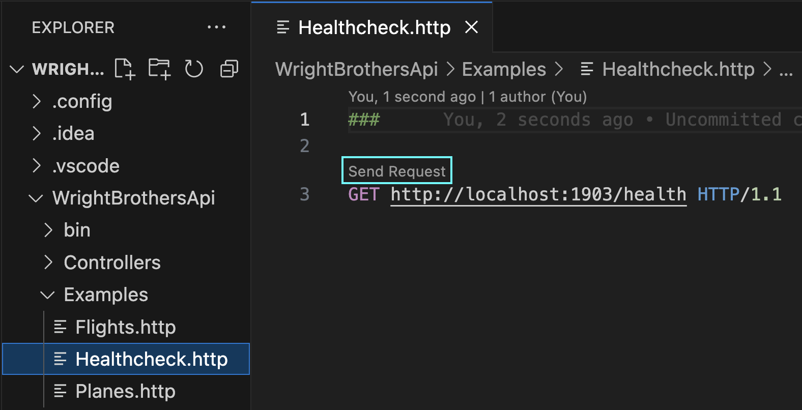
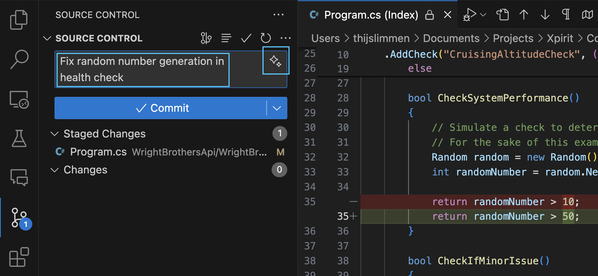
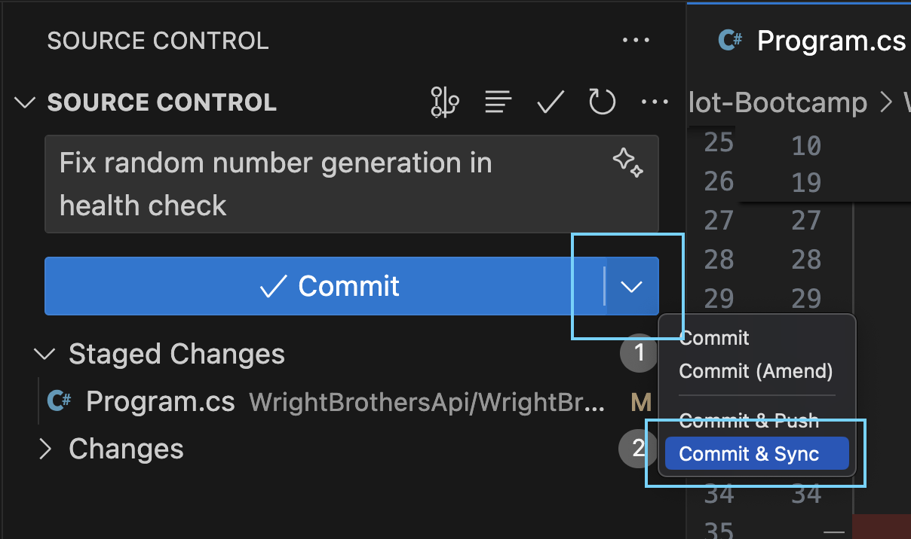
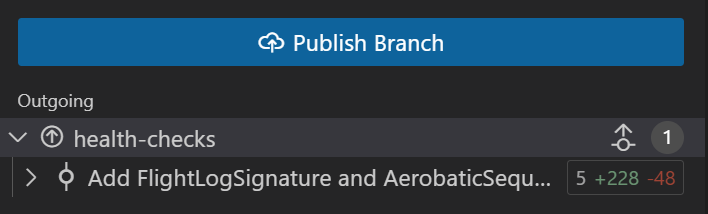
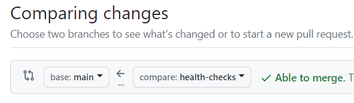
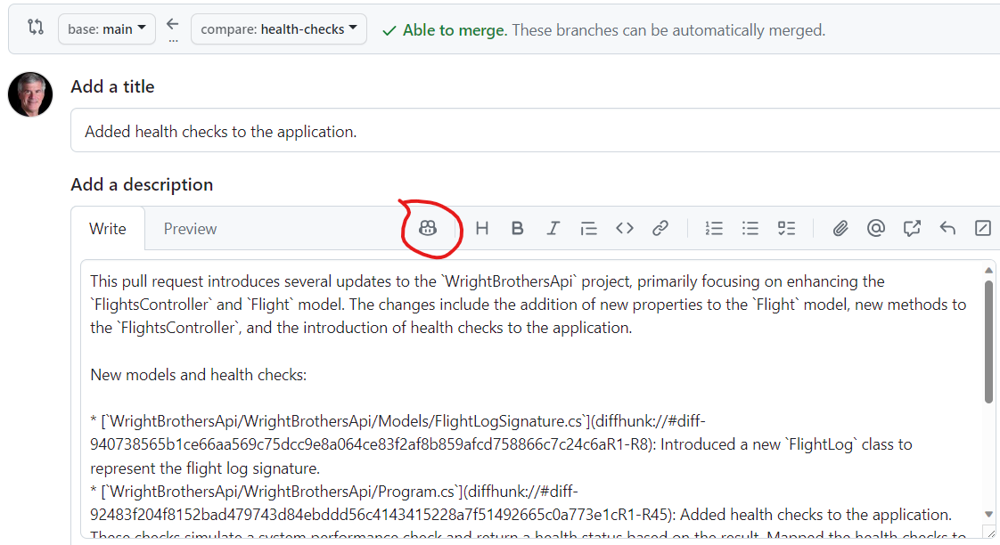
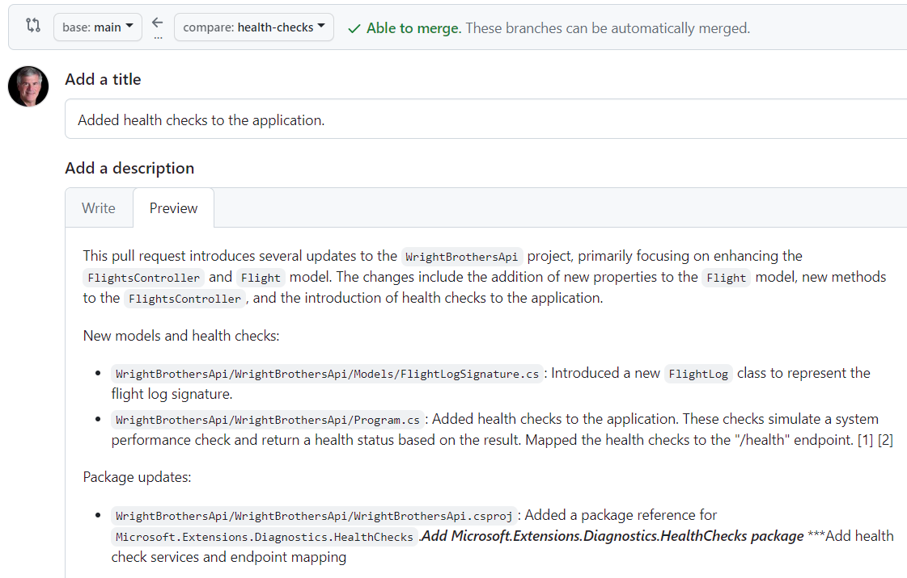
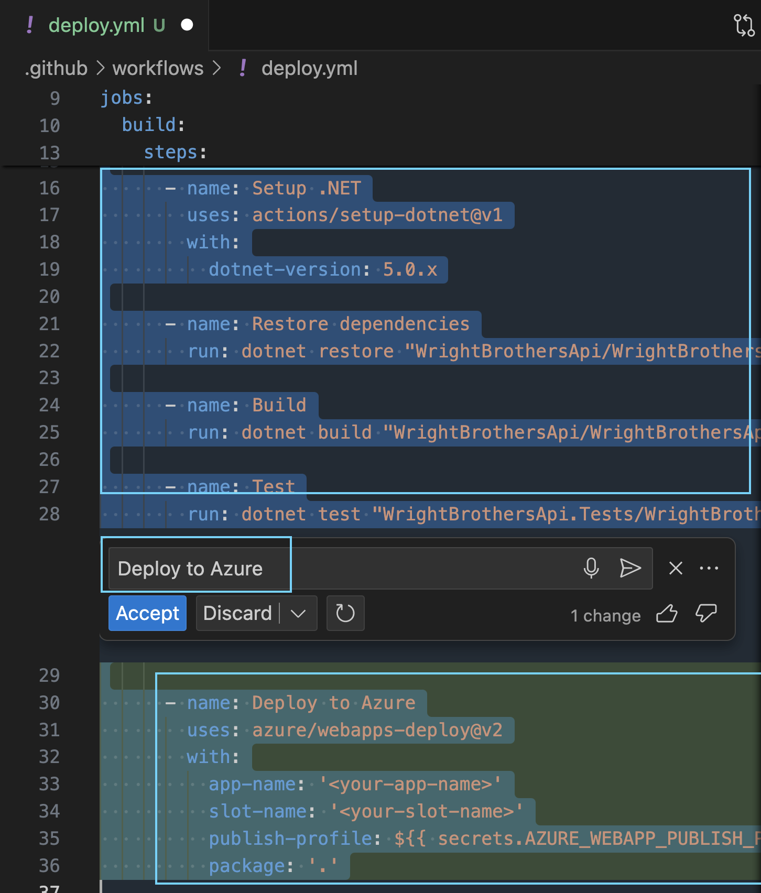
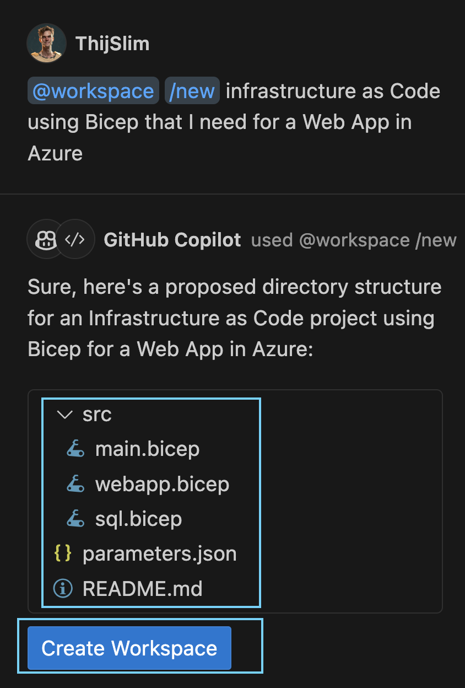

# Auto-Pilot Mode: AI Assistance in Software Development
This lab exercise demonstrates integrating GitHub Copilot into .NET application development to implement health checks, automate CI/CD pipelines for Azure deployment, and explore AI's role in enhancing software development efficiency through practical programming tasks.

## Prerequisites
- The prerequisites steps must be completed, see [Labs Prerequisites](./Labs/Lab%201.1%20-%20Pre-Flight%20Checklist)

## Estimated time to complete
- 15 min

## Objectives
- Demonstrate GitHub Copilot's capabilities in .NET development, focusing on automating health checks, CI/CD pipelines for Azure, infrastructure as code, and generating concise "Summarized Check in Comments" and "Summarized Pull Request Comments".
- Highlight Copilot's impact on streamlining development workflows, improving code quality, and enhancing collaboration through practical tasks.

### Step 1. Fasten your seatbelts, turbulence incoming - Committing Code Changes

- Open `Program.cs` in `WrightBrothersApi` folder

- Note the following code that adds a health check to the application. The healthcheck simulates a health check that sometimes is healthy, sometimes is degraded, and sometimes is unhealthy.

    ```csharp
    // Other code

    var builder = WebApplication.CreateBuilder(args);

    builder.Services.AddHealthChecks()
    .AddCheck("CruisingAltitudeCheck", () =>
    {
        bool atCruisingAltitude = CheckSystemPerformance(); 

        if (atCruisingAltitude)

        {
            return HealthCheckResult.Healthy("The application is cruising smoothly at optimal altitude.");
        }
        else
        {
            bool minorIssue = CheckIfMinorIssue();

            return minorIssue ?
                HealthCheckResult.Degraded("The application is experiencing turbulence but remains stable.") :
                HealthCheckResult.Unhealthy("The application is facing a system failure and needs immediate attention.");
        }

        bool CheckSystemPerformance()
        {
            // Simulate a check to determine if the application is "at cruising altitude"
            // For the sake of this example, we'll just return a random value
            Random random = new Random();
            int randomNumber = random.Next(1, 100);

            return randomNumber > 10;
        }

        bool CheckIfMinorIssue()
        {
            // Simulate a check to determine if the application is "at cruising altitude"
            // For the sake of this example, we'll just return a random value
            Random random = new Random();
            int randomNumber = random.Next(1, 100);

            return randomNumber > 50;
        }
    });

    // Other code
    ```

- Run the application to see the health check in action.

    ```sh
    cd WrightBrothersApi
    dotnet run
    ```

>[!Note]
> If you encounter an error message like `Project file does not exist.` or `Couldn't find a project to run.`, it's likely that you're executing the command from an incorrect directory. To resolve this, navigate to the correct directory using the command `cd ./WrightBrothersApi`. If you need to move one level up in the directory structure, use the command `cd ..`. The corrcect directory is the one that contains the `WrightBrothersApi.csproj` file.

- Open the `Examples/Healthcheck.http` file, click `Send Request` to execute the `health` request.



> [!Note]
> Screenshot is made at 8th of February 2024. The UI of the Copilot Chat extension can be different at the time you are doing the lab. (Please notify us if the UI is different.)

- Click the `Send Request` button for the `GET` below:

    ```json
    GET http://localhost:1903/health HTTP/1.1
    ```

- The response should be `200 OK` with the following body:

    ```json
    {
        "status": "Healthy", // or "Degraded" or "Unhealthy"
        "totalDuration": "00:00:00.0000001"
    }
    ```

- Stop the application by pressing `Ctrl+C` in the terminal.

- Let's make a small change to the code. Change the `CheckSystemPerformance` method to return a random number greater than 50. This will simulate a more unstable system.

    ```csharp
    bool CheckSystemPerformance()
    {
        // Simulate a check to determine if the application is "at cruising altitude"
        // For the sake of this example, we'll just return a random value
        Random random = new Random();
        int randomNumber = random.Next(1, 100);

        return randomNumber > 50;
    }
    ```

- Create a new feature branch `feature/health-checks` from the `main` branch in your terminal

```sh
git checkout -b feature/health-checks
```

- Open the Source Control tab in VS Code

- In the `Changes` area, click the `+` icon to `Stage all changes`

- Click on the `Magic` icon to generate a commit message




> [!Note]
> GitHub Copilot Chat suggests a commit message based on the changes made to the code. This is a great way to get started with a commit message.


- Click the `✓ Commit & Sync` button to commit the changes.



- Click the `Publish branch` button to push the changes.



### Step 2. Turn on Autopilot Mode - Automating GitHub Pull Requests

> [!WARNING]  
> You must complete the previous lab before continuing.

> [!Note]
> Pull Request summaries in the GitHub.com portal is not yet supported for everyone. The trainer will demo this.

- Go to your `GitHub.com` repository.

- Click on the `Pull requests` tab.

- Click on the `New pull request` button

- Select the `main` branch for the base branch.
- Select the `feature/health-checks` branch as the compare branch



- Click the `Create pull request` button

- Click on the `Copilot` icon, select `Summary` to generate a summary of changes in this pull request.



- Click `Preview` to see the summary.



- Click `Create pull request` to create the pull request.

> [!IMPORTANT]  
> This is a `Copilot Enterprise` feature only! In order to use the Pull Request Summaries feature you need a Copilot Enterprise License and have this feature enabled in your GitHub account.

## Optional

### Step 3. Smooth Flying in the Cloud - Automating GitHub Pipelines
A build pipeline automates your software's build, test, and deployment processes, ensuring consistent and error-free releases while saving time and improving code quality. It streamlines development, enables quick feedback, and supports efficient version management.  Let's begin by
automating CI/CD pipelines for deployment to Azure.

- Open the GitHub Copilot Chat extension

- Type the following command

    ```
    @workspace create a build pipeline for the application
    ```

- GitHub Copilot Chat will suggest creating a GitHub Pipeline for the application. It also includes a build step and a test step.

    ```yaml
    name: .NET Core CI

    on:
    push:
        branches: [ main ]
    pull_request:
        branches: [ main ]

    jobs:
    build:

        runs-on: ubuntu-latest

        steps:
        - uses: actions/checkout@v2

        - name: Setup .NET
        uses: actions/setup-dotnet@v1
        with:
            dotnet-version: 5.0.x

        - name: Restore dependencies
        run: dotnet restore "WrightBrothersApi/WrightBrothersApi.csproj"

        - name: Build
        run: dotnet build "WrightBrothersApi/WrightBrothersApi.csproj" --configuration Release --no-restore

        - name: Test
        run: dotnet test "WrightBrothersApi.Tests/WrightBrothersApi.Tests.csproj" --no-restore --verbosity normal
    ```

> [!Note]
> With the @workspace agent, GitHub Copilot understands that the current workspace is a .NET application with a Test project in it. It also understands that the application is hosted in a folder called `WrightBrothersApi` and the test project is in a folder called `WrightBrothersApi.Tests`. This is a great example of how GitHub Copilot can understand the context of the current workspace and provide suggestions based on that context.

## Optional

### Step 4. Ground Control - How to assent to the Azure Cloud
Deploying your application to Azure facilitates scalable, secure, and efficient hosting, leveraging Microsoft's cloud infrastructure. This allows for easy scaling, robust disaster recovery, and global reach, enhancing your app's performance and accessibility while minimizing maintenance efforts and costs.

> [!WARNING]  
> You must complete the previous lab before continuing.

- Pre-requisite is a valid `*.yaml` build pipeline from previous step.

- Select all the content of the deploy.yaml and start an inline chat with GitHub Copilot Chat.

- Type the following command

    ```
    Deploy to Azure
    ```



- GitHub Copilot Chat will suggest adding a deploy step to the pipeline, which is a Azure Web App deployment.

```yaml
# Rest of the pipeline

deploy:
    needs: build
    runs-on: ubuntu-latest
    steps:
      - name: Login to Azure
        uses: azure/login@v1
        with:
          creds: ${{ secrets.AZURE_CREDENTIALS }}

      - name: Deploy to Azure Web App
        uses: azure/webapps-deploy@v2
        with:
          app-name: 'your-app-name' # replace with your app name
          publish-profile: ${{ secrets.AZURE_PUBLISH_PROFILE }}
          package: './WrightBrothersApi'
```

- Start a new chat with GitHub Copilot Chat and type the following command

    ```
    @workspace /new infrastructure as Code using Bicep that I need for a Web App in Azure
    ```

> [!Note]
> The /new command is a special command that scaffolds a new project based on the current workspace.

- Copilot will give components need to create a Web App in Azure. and a button to create the full bicep project.



### Congratulations you've made it to the end! &#9992; &#9992; &#9992;

#### And with that, you've now concluded this module. We hope you enjoyed it! &#x1F60A;